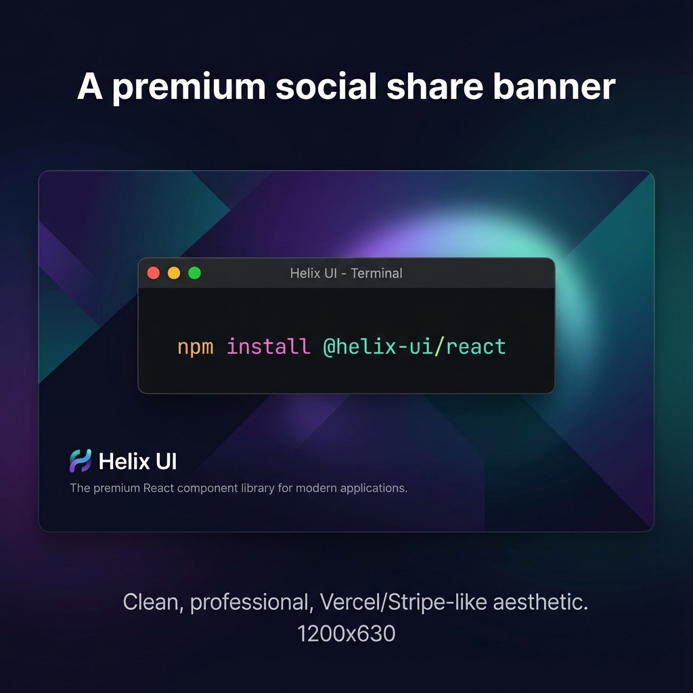

# Helix UI



Helix UI is a premium, production-ready documentation platform for a fictional UI library. Built with Next.js 16, MDX, and Tailwind CSS.


## 🚀 Quick Start

### 1. Install Dependencies
```bash
npm install
```

### 2. Start Development Server
```bash
npm run dev
```
Visit [http://localhost:3000](http://localhost:3000) to see the documentation.

### 3. Build for Production
```bash
# Local build (skips security check)
npm run build

# Production build (requires token)
HELIX_DEPLOY_TOKEN=your_token_here npm run build
```

## 🛠 Tech Stack
- **Framework**: Next.js 15 (App Router)
- **Language**: TypeScript
- **Styling**: Tailwind CSS 4
- **Docs**: MDX via `next-mdx-remote`
- **Animations**: Framer Motion
- **Icons**: Lucide React

## 📂 Folder Structure
- `app/`: Next.js App Router pages and layouts.
- `components/ui/`: Reusable UI components (Button, Card, Input, Alert).
- `components/docs/`: Documentation-specific components (Sidebar, Search, DemoBlock).
- `content/docs/`: MDX files for documentation content.
- `lib/`: Utility functions and MDX parsers.
- `scripts/`: Build-time security scripts.
- `middleware.ts`: Runtime security middleware.

## 🔐 Security Features

### Build-time Deployment Guard
Located at `scripts/deploy-guard.js`. It ensures that `HELIX_DEPLOY_TOKEN` is present during production builds or in CI environments. It will intentionally fail the build if the token is missing.

### Runtime Domain Allowlist
Located in `middleware.ts`. In production mode, it only allows requests from domains listed in the `HELIX_ALLOWED_HOSTS` environment variable (comma-separated). Unauthorized domains will receive a 403 Forbidden response.

## 📘 Adding New Components
1. Create your component in `components/ui/[name].tsx`.
2. Create a corresponding MDX file in `content/docs/[name].mdx`.
3. Add the component to the navigation in `components/docs/Sidebar.tsx` and `components/docs/SearchBox.tsx`.
